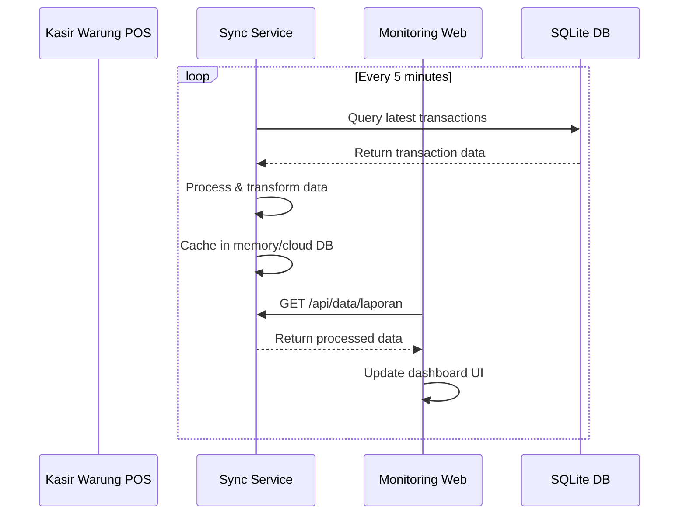

# Monitoring Web Application - Complete Implementation Plan

## Overview
A web-based monitoring system that displays Laporan (Reports) and Riwayat (Transaction History) from the Kasir Warung POS software, updating every 5 minutes with secure authentication.

---

## 📋 Architecture Overview

### System Components
```
┌─────────────────────┐         ┌──────────────────────┐         ┌─────────────────────┐
│   Kasir Warung      │         │  Sync Service        │         │  Monitoring Web     │
│   Desktop App       │◄───────►│  (Local/API Server)  │◄───────►│  Application        │
│   (Electron/React)  │   5min  │  Node.js + SQLite    │   Web   │  React + Firebase   │
└─────────────────────┘         └──────────────────────┘         └─────────────────────┘
         ▲                                  ▲                                  ▲
         │                                  │                                  │
         │                                  ▼                                  │
         │                          ┌──────────────────┐                       │
         └─────────────────────────│  Local Database  │◄───────────────────────┘
                                   │  Data Extraction │
                                   └──────────────────┘
```

---

## 🎯 Key Features

### 1. **Data Synchronization**
- **Frequency**: Every 5 minutes (configurable)
- **Data Sources**: 
  - Transactions (Laporan)
  - Transaction History (Riwayat)
  - Shifts data
  - Real-time statistics
- **Methods**: 
  - Local file polling (JSON files)
  - Direct SQLite database reading
  - IPC bridge from main process

### 2. **Authentication System**
- **Login Page**: Secure credential-based authentication
- **User Roles**: 
  - Admin (full access)
  - Manager (view only)
  - Viewer (limited view)
- **Security**: JWT tokens, session management

### 3. **Monitoring Dashboard**
- **Laporan View**: Financial reports, sales analytics, shift summaries
- **Riwayat View**: Transaction history, filters, search
- **Real-time Updates**: Auto-refresh every 5 minutes
- **Mobile Responsive**: Accessible from any device

---

## 🔧 Technical Stack

### Backend (Sync Service)
```javascript
Framework:     Node.js + Express
Database:      SQLite (read-only from POS DB)
Authentication: JWT + bcrypt
Scheduler:     node-cron (5-min intervals)
File Watcher:  chokidar (for JSON files)
API:           REST + WebSocket (optional for real-time)
```

### Frontend (Monitoring App)
```javascript
Framework:     React.js
State:         Redux / Context API
Styling:       Tailwind CSS
Charts:        Chart.js / Recharts
Auth:          Firebase Auth or JWT
Hosting:       Vercel / Railway / Render
```

---

## 📁 File Structure Plan

```
kasir-monitoring/
├── backend/
│   ├── sync-service/
│   │   ├── index.js              # Main entry point
│   │   ├── config.js             # Configuration
│   │   ├── cron-jobs/
│   │   │   └── data-sync.js      # 5-min sync scheduler
│   │   ├── services/
│   │   │   ├── data-extractor.js # Extract from POS DB/files
│   │   │   ├── auth-service.js   # Authentication logic
│   │   │   └── cache-service.js  # Data caching
│   │   ├── routes/
│   │   │   ├── auth.js           # Login/logout endpoints
│   │   │   └── data.js           # Data retrieval endpoints
│   │   ├── middleware/
│   │   │   └── auth.js           # JWT verification
│   │   └── utils/
│   │       └── database-reader.js # Read SQLite safely
│   ├── package.json
│   └── .env
│
├── frontend/
│   ├── src/
│   │   ├── components/
│   │   │   ├── Login.jsx
│   │   │   ├── Dashboard.jsx
│   │   │   ├── LaporanView.jsx
│   │   │   ├── RiwayatView.jsx
│   │   │   └── Sidebar.jsx
│   │   ├── contexts/
│   │   │   └── AuthContext.jsx
│   │   ├── hooks/
│   │   │   └── useDataSync.js
│   │   ├── services/
│   │   │   └── api.js
│   │   ├── utils/
│   │   │   └── formatters.js
│   │   └── App.jsx
│   ├── package.json
│   └── tailwind.config.js
│
├── docs/
│   ├── SETUP.md                  # Setup instructions
│   ├── DEPLOYMENT.md             # Deployment guide
│   └── API.md                    # API documentation
│
└── README.md
```

---

## 🗄️ Data Extraction Strategy

### Method 1: SQLite Direct Read (Preferred)
```javascript
// electron/db-sync.cjs
const Database = require('better-sqlite3');
const fs = require('fs');

class DataExtractor {
  constructor(dbPath) {
    this.db = new Database(dbPath, { readonly: true });
  }

  async getTransactions(filters = {}) {
    const { startDate, endDate, shiftId } = filters;
    let query = 'SELECT id, data, created_at FROM transactions WHERE 1=1';
    
    if (startDate) {
      query += ` AND date(created_at) >= '${startDate}'`;
    }
    if (endDate) {
      query += ` AND date(created_at) <= '${endDate}'`;
    }
    if (shiftId) {
      query += ` AND json_extract(data, '$.shiftId') = '${shiftId}'`;
    }

    const results = this.db.prepare(query).all();
    return results.map(row => ({
      ...JSON.parse(row.data),
      createdAt: row.created_at
    }));
  }

  async getShifts() {
    const results = this.db.prepare('SELECT id, data, created_at FROM shifts').all();
    return results.map(row => ({
      ...JSON.parse(row.data),
      id: row.id,
      createdAt: row.created_at
    }));
  }

  async getDailyStats(date) {
    const stmt = this.db.prepare(`
      SELECT 
        COUNT(*) as totalTransactions,
        SUM(json_extract(data, '$.total')) as totalRevenue,
        SUM(json_extract(data, '$.paid')) as totalPaid
      FROM transactions 
      WHERE date(created_at) = ?
    `);
    return stmt.get(date);
  }

  close() {
    this.db.close();
  }
}
```

### Method 2: JSON File Polling (Alternative)
```javascript
class FileSyncService {
  constructor(filesConfig) {
    this.files = filesConfig;
    this.chokidar = require('chokidar');
  }

  watchFiles(callback) {
    this.watcher = this.chokidar.watch([
      this.files.trx,
      this.files.shifts,
      this.files.menu
    ], {
      persistent: true,
      interval: 300 // 5 minutes
    });

    this.watcher.on('change', (path) => {
      console.log(`File changed: ${path}`);
      callback();
    });
  }
}
```

---

## 🔐 Authentication Implementation

### Backend Auth Middleware
```javascript
// backend/sync-service/middleware/auth.js
const jwt = require('jsonwebtoken');

const authenticateToken = (req, res, next) => {
  const authHeader = req.headers['authorization'];
  const token = authHeader && authHeader.split(' ')[1];

  if (!token) {
    return res.status(401).json({ error: 'Access token required' });
  }

  jwt.verify(token, process.env.JWT_SECRET, (err, user) => {
    if (err) {
      return res.status(403).json({ error: 'Invalid or expired token' });
    }
    req.user = user;
    next();
  });
};

module.exports = { authenticateToken };
```

### User Registration & Login
```javascript
// backend/sync-service/routes/auth.js
const express = require('express');
const bcrypt = require('bcrypt');
const jwt = require('jsonwebtoken');
const router = express.Router();

// Sample users in database (could be SQLite/MySQL too)
const users = [
  { id: 1, username: 'admin', password: '$2b$10$...', role: 'admin' },
  { id: 2, username: 'manager', password: '$2b$10$...', role: 'manager' }
];

// Login endpoint
router.post('/login', async (req, res) => {
  try {
    const { username, password } = req.body;
    
    const user = users.find(u => u.username === username);
    if (!user || !(await bcrypt.compare(password, user.password))) {
      return res.status(401).json({ error: 'Invalid credentials' });
    }

    const token = jwt.sign(
      { id: user.id, username: user.username, role: user.role },
      process.env.JWT_SECRET,
      { expiresIn: '24h' }
    );

    res.json({ 
      success: true, 
      token, 
      user: { id: user.id, username: user.username, role: user.role }
    });
  } catch (error) {
    res.status(500).json({ error: 'Server error' });
  }
});

module.exports = router;
```

---

## 🚀 Hosting & Deployment Options

### Option A: Self-Hosted on Local Network (Recommended for Small Setup)
```
Server: Raspberry Pi / Old PC / NAS
OS: Linux (Ubuntu/Debian)
Services:
  - Sync Service: Docker container (port 3000)
  - Frontend: Nginx reverse proxy
  - SSL: Let's Encrypt
```

**Pros:**
- No internet dependency
- Full control over data
- Low cost
- Fast local network speeds

**Cons:**
- Requires local server maintenance
- Limited remote access

### Option B: Cloud Hosting (Best for Remote Access)
```
Backend: Railway / Render / Heroku (free tiers available)
Frontend: Vercel / Netlify (free tiers available)
Database: PostgreSQL (managed) or sync to cloud DB
```

**Pros:**
- Always accessible from anywhere
- No local hardware needed
- Automatic scaling
- Professional uptime

**Cons:**
- Monthly costs ($5-20/month)
- Internet dependency
- Data privacy considerations

### Option C: Hybrid Approach
```
Local: Sync service runs on same machine as POS
Cloud: Frontend hosted on Vercel + Firebase Auth
Sync: HTTPS calls from cloud to local (via ngrok/tunnel)
```

---

## ⚙️ Cron Job Configuration (5-minute sync)

```javascript
// backend/sync-service/cron-jobs/data-sync.js
const cron = require('node-cron');

class DataSyncScheduler {
  constructor(syncService) {
    this.syncService = syncService;
  }

  start() {
    // Run every 5 minutes
    cron.schedule('*/5 * * * *', async () => {
      try {
        console.log('[SYNC] Starting scheduled data sync...');
        const result = await this.syncService.sync();
        console.log('[SYNC] Sync completed:', result);
      } catch (error) {
        console.error('[SYNC] Sync failed:', error.message);
      }
    }, {
      scheduled: true,
      timezone: "Asia/Jakarta" // Adjust to your timezone
    });

    // Initial sync on startup
    this.syncService.sync();
  }
}
```

---

## 📊 API Endpoints Design

### Authentication
```
POST /api/auth/login          - Login user
POST /api/auth/logout         - Logout user
GET  /api/auth/me             - Get current user info
```

### Data Endpoints
```
GET  /api/data/transactions   - Get all transactions
GET  /api/data/transactions/:id - Get single transaction
GET  /api/data/shifts         - Get all shifts
GET  /api/data/stats/daily    - Get daily statistics
GET  /api/data/menu           - Get menu items
GET  /api/data/reports/laporan - Full laporan data
GET  /api/data/reports/riwayat - Full riwayat data
```

### Health Check
```
GET  /api/health              - Service health check
GET  /api/status              - Last sync status
```

---

## 🎨 Frontend Components

### Login Page (`frontend/src/components/Login.jsx`)
```jsx
import { useState } from 'react';
import { authApi } from '../services/api';

function Login({ onLogin }) {
  const [username, setUsername] = useState('');
  const [password, setPassword] = useState('');
  const [error, setError] = useState('');

  const handleSubmit = async (e) => {
    e.preventDefault();
    try {
      const response = await authApi.login(username, password);
      onLogin(response.token, response.user);
    } catch (err) {
      setError(err.message);
    }
  };

  return (
    <div className="min-h-screen flex items-center justify-center bg-gradient-to-br from-blue-500 to-purple-600">
      <div className="bg-white p-8 rounded-lg shadow-xl w-full max-w-md">
        <h1 className="text-3xl font-bold text-center mb-8">Kasir Warung Monitor</h1>
        <form onSubmit={handleSubmit}>
          <input
            type="text"
            placeholder="Username"
            value={username}
            onChange={(e) => setUsername(e.target.value)}
            className="w-full p-3 border rounded mb-4"
          />
          <input
            type="password"
            placeholder="Password"
            value={password}
            onChange={(e) => setPassword(e.target.value)}
            className="w-full p-3 border rounded mb-4"
          />
          {error && <div className="text-red-500 mb-4">{error}</div>}
          <button type="submit" className="w-full bg-blue-600 text-white p-3 rounded hover:bg-blue-700">
            Login
          </button>
        </form>
      </div>
    </div>
  );
}
```

### Laporan View (`frontend/src/components/LaporanView.jsx`)
```jsx
import { useEffect, useState } from 'react';
import { dataApi } from '../services/api';
import { BarChart, Bar, XAxis, YAxis, CartesianGrid, Tooltip, Legend, ResponsiveContainer } from 'recharts';

function LaporanView({ authToken }) {
  const [data, setData] = useState(null);
  const [loading, setLoading] = useState(true);

  useEffect(() => {
    fetchData();
    const interval = setInterval(fetchData, 300000); // 5 minutes
    return () => clearInterval(interval);
  }, [authToken]);

  const fetchData = async () => {
    try {
      const response = await dataApi.getLaporan(authToken);
      setData(response);
      setLoading(false);
    } catch (error) {
      console.error('Failed to fetch laporan:', error);
      setLoading(false);
    }
  };

  if (loading) return <div>Loading reports...</div>;

  return (
    <div className="p-6">
      <h1 className="text-2xl font-bold mb-6">Laporan Keuangan</h1>
      
      <div className="grid grid-cols-1 md:grid-cols-4 gap-4 mb-8">
        <StatCard title="Total Revenue" value={`Rp ${data.totalRevenue}`} />
        <StatCard title="Total Transactions" value={data.totalTransactions} />
        <StatCard title="Profit" value={`Rp ${data.netProfit}`} />
        <StatCard title="Average Order" value={`Rp ${data.avgOrderValue}`} />
      </div>

      <div className="mb-8">
        <h2 className="text-xl font-bold mb-4">Sales Trend</h2>
        <ResponsiveContainer width="100%" height={400}>
          <BarChart data={data.dailySales}>
            <CartesianGrid strokeDasharray="3 3" />
            <XAxis dataKey="date" />
            <YAxis />
            <Tooltip />
            <Legend />
            <Bar dataKey="revenue" fill="#3b82f6" />
            <Bar dataKey="profit" fill="#10b981" />
          </BarChart>
        </ResponsiveContainer>
      </div>
    </div>
  );
}
```

---

## 🔄 Update Flow Diagram



---

## 🛠️ Implementation Steps

### Phase 1: Backend Setup (Days 1-2)
1. ✅ Create project structure
2. ✅ Set up Express server
3. ✅ Implement SQLite reader
4. ✅ Build authentication system
5. ✅ Create data extraction service

### Phase 2: Sync Service (Days 3-4)
1. ✅ Implement 5-minute cron job
2. ✅ Add file watching alternative
3. ✅ Build data transformation pipeline
4. ✅ Create API endpoints
5. ✅ Add logging and error handling

### Phase 3: Frontend Development (Days 5-7)
1. ✅ Set up React project
2. ✅ Build login page with authentication
3. ✅ Create Laporan component
4. ✅ Create Riwayat component
5. ✅ Implement auto-refresh
6. ✅ Add charts and visualizations

### Phase 4: Testing & Deployment (Days 8-10)
1. ✅ Test locally with POS
2. ✅ Deploy backend to cloud
3. ✅ Deploy frontend to Vercel
4. ✅ Configure environment variables
5. ✅ Set up monitoring/logging
6. ✅ Document everything

---

## 🔒 Security Considerations

1. **Authentication**:
   - Use strong password hashing (bcrypt)
   - Implement rate limiting on login
   - JWT tokens with expiration
   - Refresh token mechanism

2. **Data Protection**:
   - HTTPS only (SSL/TLS)
   - Input validation/sanitization
   - SQL injection prevention (read-only queries)
   - CORS configuration

3. **Access Control**:
   - Role-based permissions
   - Session timeout
   - Audit logging

---

## 📈 Monitoring & Maintenance

### Metrics to Track
- Sync success/failure rates
- API response times
- User activity logs
- Data freshness (last update time)

### Alerting
- Email notifications on sync failures
- Daily summary reports
- Weekly usage statistics

---

## 💰 Cost Breakdown

### Self-Hosted (One-time + Minimal)
- Hardware: $50-200 (used PC/Raspberry Pi)
- Power: ~$5/month
- Domain: $10/year
- Total: ~$200 upfront + $60/year

### Cloud Hosting (Monthly)
- Backend (Railway/Render): Free-$10/month
- Frontend (Vercel): Free
- Domain: $10/year
- Total: ~$120-240/year

---

## 🎯 Success Criteria

✅ System updates every 5 minutes automatically
✅ Secure login with multiple user roles
✅ Real-time display of Laporan and Riwayat
✅ Mobile-responsive design
✅ Reliable sync even when POS is busy
✅ Easy setup and deployment
✅ Comprehensive documentation

---

**Next Step**: Begin implementation starting with backend sync service!

