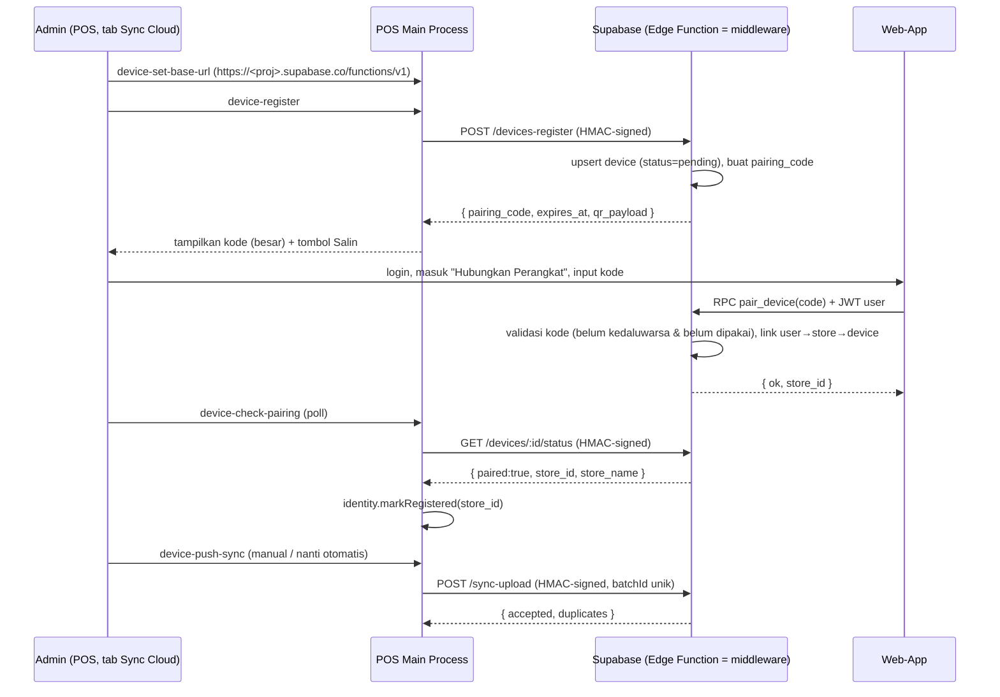

# PLAN — UI "Sync Cloud" (Admin) + Middleware Supabase

> Lanjutan dari `PLAN-WEBSYNC.md`. Sisi software POS (device identity + client +
> IPC) **sudah selesai** — lihat `electron/device-identity.cjs`,
> `device-sync-client.cjs`, `device-sync-service.cjs`.
>
> Dokumen ini = **rencana**. Belum ada kode UI yang diubah.
> Tujuan: (1) UI admin untuk pairing & kirim data, (2) skema + middleware Supabase.

---

## 0. Prinsip & batasan

1. **Secret tidak pernah masuk renderer kecuali untuk pairing manual** — channel
   `device-credential` hanya dipanggil user secara eksplisit dan ditampilkan
   singkat, tidak pernah disimpan di state global / localStorage.
2. **Semua jaringan lewat main process** — renderer hanya memanggil `window.kasirAPI.*`;
   tidak ada `fetch` langsung ke Supabase dari renderer (menghindari CORS + kebocoran secret).
3. **Admin-only** — tab & aksi dibatasi `isAdminUser(currentUser)` (pola sama seperti
   `UsersSettingsTab`).
4. **Supabase = middleware/relay, bukan sumber kebenaran auth** — POS tetap pemilik
   data; Supabase hanya: (a) memverifikasi signature perangkat, (b) menyimpan
   mapping store↔device, (c) menyediakan data untuk web-app.
5. **Idempoten** — pakai `batchId`/`ON CONFLICT DO NOTHING` supaya retry aman.
6. **Tidak menyentuh** `.ykk_lic` / `checkLicense` / `activateLicense`.

---

## 1. Alur end-to-end (final)



---

## 2. Bagian A — UI "Sync Cloud" (sisi POS)

### 2.1 File baru

| File | Isi |
|---|---|
| `src/hooks/useDeviceSync.js` | State + aksi; aman tanpa Electron (`available` flag) |
| `src/components/modals/settings-tabs/CloudSyncSettingsTab.jsx` | Panel UI admin |

### 2.2 File yang diedit (kecil & terisolasi)

| File | Perubahan |
|---|---|
| `src/components/modals/settings-tabs/index.js` | `export * from "./CloudSyncSettingsTab.jsx";` |
| `src/components/modals/SettingsModal.jsx` | import + entry `["cloud","Sync Cloud"]` + `case "cloud"` (kirim `authH`) |

Tidak ada dependensi baru. Ikon memakai emoji/teks seperti tab lain.

### 2.3 Kontrak hook `useDeviceSync`

```js
// src/hooks/useDeviceSync.js
export function useDeviceSync({ toast_ } = {}) {
  // state
  //  available   : boolean  (window.kasirAPI?.deviceStatus ada)
  //  identity    : { deviceId, deviceName, createdAt, registered, storeId, lastRegisteredAt }
  //  baseUrl     : string
  //  saving      : boolean
  //  registering : boolean
  //  pairing     : { code, expiresAt, qrPayload } | null
  //  busy        : boolean
  // aksi
  //  refresh(), setBaseUrl(url), register(), checkPairing(),
  //  pushNow({ kind }), rotate(), rename(name), revealCredential()
  return { available, identity, baseUrl, saving, registering, pairing, busy, ...aksi };
}
```

Aturan implementasi:
- Semua panggilan lewat `api.device*` yang **sudah** dibungkus `safeIpc` di
  `src/utilities/utils.js` → tidak ada uncaught promise.
- `refresh()` dipanggil saat mount + setelah tiap aksi sukses.
- **Polling pairing**: setelah `register()`, `setInterval` tiap 5 detik memanggil
  `checkPairing()`; berhenti saat `registered===true`, komponen unmount, atau
  setelah ~10 menit (kode kedaluwarsa). Bersihkan interval di `useEffect` cleanup.
- `toast_` untuk feedback sukses/gagal (pola `settingsH.toast_`).

### 2.4 Tata letak `CloudSyncSettingsTab.jsx`

```
┌ Sync Cloud ───────────────────────────────────────────────┐
│ ⓘ Sinkronkan data ke cloud. Hanya admin.                  │
│                                                            │
│ [Status: Belum terhubung / Terhubung ke "Toko A"]  ●pill  │
│                                                            │
│ URL Backend (Supabase Functions)                           │
│ [ https://xxxx.supabase.co/functions/v1            ] [Simpan]│
│                                                            │
│ Perangkat ini                                              │
│   Nama   : DEN POS — Kasir-01            [Ubah nama]       │
│   Device : dev_3f9a...c21                [Salin]           │
│   Dibuat : 28/09/2026 19:20                                │
│                                                            │
│ [ Daftarkan & Minta Kode ]        (butuh URL)              │
│                                                            │
│ ── Kode Pairing ─────────────────────────────────────────  │
│              4 8 - 2 F - 9 C - 1 A        (font besar)     │
│              Berlaku s/d 19:35 (10 menit)   [Salin kode]   │
│   Masukkan kode ini di Web-App → "Hubungkan Perangkat".    │
│   Menunggu persetujuan… (spinner)                          │
│                                                            │
│ ── Kirim Data ──────────────────────────────────────────── │
│  Transaksi belum terkirim : 12    [ Kirim Sekarang ]       │
│                                                            │
│ ── Lanjutan ─────────────────────────────────────────────  │
│  [ Tampilkan kredensial ]  [ Regenerasi kredensial ] ⚠     │
└────────────────────────────────────────────────────────────┘
```

- Pakai `fieldStyle` & `SaveButton` dari `shared.jsx` untuk konsistensi.
- `Salin` memakai `navigator.clipboard.writeText` dengan fallback `toast_` kalau gagal.
- Tombol **Regenerasi kredensial** memunculkan konfirmasi (`window.confirm` atau
  modal kecil) karena pairing lama gugur; setelah rotate → status balik "Belum terhubung".
- **Tampilkan kredensial**: `revealCredential()` → tampil 8 detik lalu auto-hide,
  dengan peringatan "Jangan bagikan". (Ini satu-satunya jalur secret ke UI.)

### 2.5 Gating admin

`SettingsModal` mengoper `authH` (sudah ada). Di dalam tab:
```js
const isAdmin = isAdminUser(authH?.currentUser);   // dari src/utilities/users.js
if (!isAdmin) return <EmptyState text="Hanya admin yang dapat mengatur Sync Cloud." />;
```
(`EmptyState` kecil lokal, atau teks biasa.)

### 2.6 Perubahan kecil di main process untuk "belum terkirim"

Agar counter "Transaksi belum terkirim" nyata (bukan 0 statis), tambah 1 IPC tipis:

- `electron/device-sync-service.cjs`: `ipcMain.handle("device-pending-count", () => onPendingCount())`
  dengan `onPendingCount` disuntik dari `main.cjs`.
- `main.cjs`: `onPendingCount: () => database.countUnsyncedTransactions?.() ?? 0`.
- Perlu **1 kolom** di tabel `transactions`: `synced_at TEXT NULL` + index parsial
  `WHERE synced_at IS NULL`. `db.cjs`: `countUnsyncedTransactions()` & (saat push sukses)
  `markTransactionsSynced(ids, batchId)`.
- **Alternatif tanpa migrasi** (kalau ingin minim risiko): pakai `enqueue` batchId di
  config `device-sync.json` dan hitung dari situ. Migrasi kolom lebih benar jangka panjang.

> Saat "Kirim Sekarang": ambil N baris `synced_at IS NULL` (limit 2000) → `device-push-sync`
> → kalau `accepted`, panggil `markTransactionsSynced`. Ini juga fondasi untuk
> **auto-push** nanti (interval/cron) tanpa mengubah UI.

---

## 3. Bagian B — Middleware Supabase

### 3.1 Peta konsep → tabel

| Plan (entitas) | Supabase |
|---|---|
| `stores` | tabel `stores` |
| `devices` | tabel `devices` |
| `store_users` | tabel `store_users` (+ RLS) |
| `pairing_codes` | tabel `pairing_codes` |
| `synced_data` | tabel `synced_transactions` (+ tabel per jenis nanti) |
| middleware `storeAccess` | **RLS policy** (menggantikan cek manual) |
| `HMAC` verification | Edge Function `devices-*`, `sync-*` |

**Keputusan penting:** auth POS (HMAC) **tidak** cocok dengan RLS/Supabase Auth,
karena POS bukan user. Maka:
- Endpoint mesin (`devices-register`, `devices-status`, `sync-upload`) → **Edge Functions**
  yang memverifikasi HMAC dengan `service_role` (bypass RLS secara terkendali).
- Akses web-app (baca data) → **RLS** normal dengan `auth.uid()`.
- Pairing (web-app menulis) → **RPC** (`security definer`) supaya web tidak perlu
  izin tulis tabel secara langsung.

### 3.2 Skema SQL (ringkas)

```sql
-- STORES
create table stores (
  id uuid primary key default gen_random_uuid(),
  public_id text unique not null,
  name text not null,
  status text not null default 'active',
  created_at timestamptz default now()
);

-- DEVICES (credential_hash = sha256(device_secret), bukan HMAC ber-key server)
create table devices (
  id uuid primary key default gen_random_uuid(),
  store_id uuid references stores(id) on delete set null,
  device_id text unique not null,          -- dev_xxxx dari POS
  device_name text,
  credential_hash text not null,           -- sha256(secret); verifikasi dulu hash, baru tanda tangan
  status text not null default 'pending',  -- pending|active|revoked
  last_seen_at timestamptz,
  created_at timestamptz default now()
);
create index on devices(store_id);

-- PAIRING CODES (simpan HASH, bukan kode mentah)
create table pairing_codes (
  id uuid primary key default gen_random_uuid(),
  device_id text not null references devices(device_id) on delete cascade,
  code_hash text not null,
  expires_at timestamptz not null,
  used_at timestamptz,
  used_by uuid references auth.users(id),
  created_at timestamptz default now()
);
create index on pairing_codes(device_id);

-- STORE_USERS (siapa boleh lihat store mana) → dasar RLS
create table store_users (
  user_id uuid not null references auth.users(id) on delete cascade,
  store_id uuid not null references stores(id) on delete cascade,
  permission text not null default 'owner', -- owner|staff|viewer
  created_at timestamptz default now(),
  primary key (user_id, store_id)
);

-- SYNCED TRANSACTIONS (idempoten)
create table synced_transactions (
  id uuid primary key default gen_random_uuid(),
  store_id uuid not null references stores(id) on delete cascade,
  device_id text not null,
  trx_id text not null,
  batch_id uuid,
  payload jsonb not null,
  occurred_at timestamptz,
  synced_at timestamptz default now(),
  unique (store_id, trx_id)
);
create index on synced_transactions (store_id, occurred_at desc);
```

### 3.3 RLS (pengganti middleware `storeAccess`)

```sql
alter table stores enable row level security;
alter table devices enable row level security;
alter table store_users enable row level security;
alter table synced_transactions enable row level security;

-- helper: user boleh lihat store?
create or replace function can_access_store(p_store uuid)
returns boolean language sql stable security definer as $$
  select exists (
    select 1 from store_users
    where user_id = auth.uid() and store_id = p_store
  );
$$;

create policy store_member_read on stores
  for select using (can_access_store(id));

create policy store_member_read_devices on devices
  for select using (can_access_store(store_id));

create policy store_member_read_trx on synced_transactions
  for select using (can_access_store(store_id));
-- Tidak ada policy insert/update untuk web: tulis hanya lewat Edge Function/RPC (service_role).
```

> Ini memenuhi syarat plan: "filtering harus di backend/database, bukan hanya
> menyembunyikan pilihan store di React." Web-app **tidak bisa** membaca store
> orang lain walau mengubah `storeId` di browser.

### 3.4 RPC pairing (dipanggil web-app)

```sql
create or replace function pair_device(p_code text)
returns table (store_id uuid, store_name text)
language plpgsql security definer as $$
declare
  v_row pairing_codes%rowtype;
  v_store uuid;
  v_name  text;
begin
  -- cari kode yang cocok & masih berlaku
  select * into v_row
  from pairing_codes
  where code_hash = encode(digest(upper(p_code), 'sha256'), 'hex')
    and used_at is null
    and expires_at > now()
  order by created_at desc
  limit 1;

  if not found then raise exception 'PAIRING_CODE_INVALID'; end if;

  -- butuh store: buat baru sekali untuk device ini kalau belum ada
  select store_id into v_store from devices where device_id = v_row.device_id;
  if v_store is null then
    insert into stores(public_id, name)
    values (gen_random_uuid()::text, 'Toko Baru')
    returning id, name into v_store, v_name;

    update devices set store_id = v_store, status = 'active'
    where device_id = v_row.device_id;
  else
    select name into v_name from stores where id = v_store;
  end if;

  insert into store_users(user_id, store_id, permission)
  values (auth.uid(), v_store, 'owner')
  on conflict do nothing;

  update pairing_codes set used_at = now(), used_by = auth.uid()
  where id = v_row.id;

  return query select v_store, v_name;
end $$;
```

### 3.5 Edge Functions (mesin POS, verifikasi HMAC)

Semua di `supabase/functions/`, runtime Deno, `import { createClient } from "jsr:@supabase/supabase-js@2"`.

**Verifikasi signature (dipakai bersama, `_shared/verify.ts`):**

```ts
// Urutan: (1) lookup device by X-Device-ID; (2) cek status != revoked
// (3) timpa tanda tangan: sha256(device_secret) === credential_hash
// (4) cek skew timestamp <= 300s, (5) cek nonce belum dipakai (tabel nonces)
// (6) HMAC-SHA256(secret, `${ts}.${nonce}.${rawBody}`) === X-Device-Signature
```

> Catatan: POS mengirim `X-Device-ID`, `-Timestamp`, `-Nonce`, `-Signature`
> dengan body **sudah** string JSON (lihat `device-sync-client.cjs`). Edge Function
> harus memakai **raw body** (`await req.text()`) — jangan `req.json()` lalu
> stringify ulang, urutan key bisa berubah dan signature gagal.

| Function | Method | Tugas |
|---|---|---|
| `devices-register` | POST | upsert device (pending) + buat `pairing_codes` (hash) + kembalikan `pairing_code`, `expires_at`, `qr_payload` |
| `devices-status` | GET | balikan `{ paired, store_id, store_name, status }` |
| `devices-heartbeat` | POST | update `last_seen_at` |
| `sync-upload` | POST | verifikasi HMAC → `insert ... on conflict (store_id, trx_id) do nothing` → hitung `accepted` vs `duplicates` |

**Endpoint minimum dari plan** (✅ sudah dicover):
`register`✅ `status`✅ `heartbeat`✅ `sync/upload`✅. `pairing-code` (regenerate)
bisa ditambah sebagai `POST /devices-register` idempoten atau function terpisah nanti.
`GET /stores` & `GET /stores/:id/data` untuk web-app cukup lewat **RLS + PostgREST**
(tanpa Edge Function).

### 3.6 Keamanan yang wajib (dari §"Fitur administrasi" plan)

- [x] Secret perangkat **tidak** disimpan plaintext → `credential_hash = sha256(secret)`.
- [x] `pairing_codes` menyimpan **hash**, bukan kode mentah.
- [x] Nonce + timestamp → tahan replay (tabel `device_nonces`, TTL dibersihkan berkala).
- [x] RLS = isolasi store (user tak bisa lihat store lain).
- [x] Rate limit login/pairing/sync (Supabase: `pg_cron` pembersih + limit di Edge Function / API gateway).
- [x] HTTPS wajib (default Supabase).
- [ ] Audit log `device_events` (pair/revoke/rotate) — fase lanjutan.
- [ ] Revoke device (`status='revoked'`) → `devices-status` mengembalikan `paired:false`,
      POS otomatis `clearRegistration()` (sudah berjalan di service POS).

### 3.7 Konfigurasi POS untuk Supabase

`baseUrl` diisi `https://<project-ref>.supabase.co/functions/v1`.
Jalur: tab Sync Cloud → kolom "URL Backend" → `device-set-base-url`.
Tidak perlu anon key di POS karena auth mesin pakai HMAC (bukan JWT Supabase).
(Anon key hanya untuk web-app.)

---

## 4. Checklist implementasi (saat mulai edit)

**Fase A — UI (POS)**
1. `src/hooks/useDeviceSync.js` (+ tes ringan `useDeviceSync` bila perlu).
2. `CloudSyncSettingsTab.jsx` (status, URL, daftar+kode, kirim, lanjutan).
3. Daftarkan tab di `index.js` + `SettingsModal.jsx` (termasuk gating admin).
4. (Opsional) kolom `synced_at` + `countUnsyncedTransactions()` + `markTransactionsSynced()`
   di `db.cjs`, IPC `device-pending-count`, tombol "Kirim Sekarang" memakai itu.
5. Tes: komponen tab (available/not available, gating admin, alur register→pairing pill).
6. `npx vitest run` (pastikan tak ada regresi) + `npx vite build`.

**Fase B — Supabase (middleware)**
7. `supabase/migrations/0001_init.sql` (tabel + RLS + `can_access_store` + `pair_device`).
8. `supabase/functions/_shared/{supabase.ts,verify.ts,cors.ts}`.
9. `supabase/functions/{devices-register,devices-status,devices-heartbeat,sync-upload}/index.ts`.
10. Uji dengan `supabase functions serve` + `curl` bertanda tangan (buat skrip kecil
    `scripts/sign-request.mjs` yang mereplikasi HMAC client untuk uji lokal).
11. Uji negatif: signature salah, timestamp basi, nonce diulang, device revoked,
    user mencoba akses `store_id` orang lain (harus 403 lewat RLS).

---

## 5. Yang sengaja DITUNDA (biar fokus)

- Auto-sync terjadwal (cron/heartbeat→push) — fondasinya sudah disiapkan (`synced_at` + `push`).
- Audit log penuh & UI manajemen device di web-app.
- Rotasi `device_secret` terjadwal + revoke jarak-jauh dari web.
- Sinkronisasi tabel selain transaksi (produk, stok, customer, resep).
- Realtime (Supabase Realtime) untuk dashboard web.

---

## 6. Ringkas keputusan

1. **UI di Settings → tab "Sync Cloud"**, admin-only, reuse `shared.jsx`, tanpa dep baru.
2. **Pairing code & QR dari backend**, POS hanya menampilkan.
3. **Supabase:** tabel + **RLS** untuk isolasi store (pengganti middleware manual),
   **Edge Functions** untuk auth mesin HMAC, **RPC `pair_device`** untuk web-app.
4. **Raw body** wajib di verifikasi HMAC (jangan parse→stringify ulang).
5. POS **tidak menyimpan anon key**; auth via HMAC. Web-app pakai Supabase Auth + RLS.
