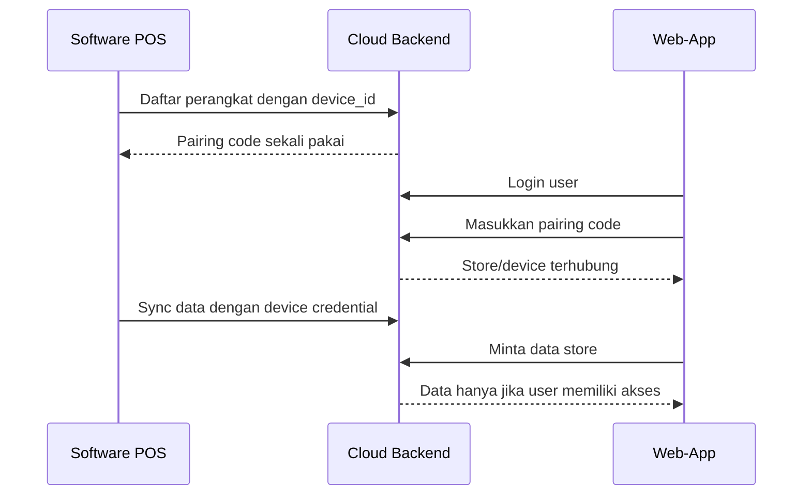

Bisa. Kebutuhan ini sebaiknya dibuat sebagai **multi-tenant device pairing**, bukan hanya menambahkan `unique_id` di frontend. ID harus diverifikasi oleh backend dan software POS harus memiliki kredensial rahasia yang tidak bisa diubah dari browser.

## Arsitektur yang disarankan



## Entitas utama

### `stores`

Mewakili satu bisnis atau instalasi software.

```text
id
public_id
name
created_at
status
```

### `devices`

Mewakili instalasi software tertentu.

```text
id
store_id
device_id
device_name
credential_hash
status
last_seen_at
created_at
```

### `users`

Tambahkan hubungan user ke store:

```text
id
username
password_hash
role
```

### `store_users`

```text
user_id
store_id
permission
```

### `pairing_codes`

```text
id
code_hash
store_id
expires_at
used_at
created_by
```

## Alur pairing

1. Saat software POS pertama kali dijalankan:
   - Generate `device_id` secara acak.
   - Generate `device_secret`.
   - Simpan secret di folder data aplikasi.
   - Daftarkan perangkat ke backend.
   - Backend mengembalikan pairing code, misalnya berlaku 10 menit.

2. Admin login ke web-app.

3. Admin memasukkan pairing code.

4. Backend memvalidasi:
   - pairing code masih berlaku;
   - belum pernah dipakai;
   - device valid;
   - user memiliki hak untuk memasangkan device.

5. Backend menghubungkan:

```text
user -> store -> device
```

6. Setelah pairing berhasil, pairing code langsung tidak dapat digunakan lagi.

## Saat software mengirim data

Software tidak boleh hanya mengirim `device_id`, karena ID publik mudah dipalsukan.

Gunakan kombinasi:

```text
device_id
timestamp
nonce
signature = HMAC-SHA256(device_secret, request_payload)
```

Backend memvalidasi signature sebelum menerima data.

Contoh header:

```text
X-Device-ID: device_xxx
X-Device-Timestamp: 1720000000
X-Device-Nonce: random-value
X-Device-Signature: calculated-hmac
```

Untuk keamanan lebih tinggi saat production, gunakan **TLS/mTLS** atau minimal HTTPS + HMAC + rotasi secret.

## Saat web-app mengambil data

JWT web-app harus memuat identitas user, tetapi `store_id` jangan dipercaya dari frontend.

Backend harus memeriksa setiap request:

```text
JWT user
  ↓
user memiliki akses ke store_id?
  ↓
store memiliki device aktif?
  ↓
data hanya dari store tersebut
```

Contoh middleware:

```js
const storeAccess = async (req, res, next) => {
  const storeId = req.params.storeId || req.query.storeId;

  const allowed = await accessRepository.userCanAccessStore(
    req.user.id,
    storeId
  );

  if (!allowed) {
    return res.status(403).json({
      error: 'STORE_ACCESS_DENIED'
    });
  }

  req.storeId = storeId;
  next();
};
```

Yang penting: filtering harus dilakukan di backend/database, bukan hanya menyembunyikan pilihan store di React.

## Perubahan penting pada kondisi sekarang

Dari struktur saat ini:

- `AuthService` masih menggunakan user default di memory.
- Belum ada `store_id`, `device_id`, atau tabel relasi user-store.
- `data.js` mengambil data dari satu `POS_DB_PATH`.
- Backend masih terlihat seperti satu instance backend untuk satu database lokal.
- Endpoint data sudah memakai autentikasi, tetapi belum memakai pemeriksaan kepemilikan store.

Sebelum launch cloud, backend perlu diubah menjadi:

```text
Cloud Backend
├── users
├── stores
├── devices
├── store_users
├── pairing_codes
└── synced_data
```

Software POS sebaiknya tidak lagi membuat cloud membaca file SQLite lokal secara langsung. Software POS harus menjadi **sync client** yang mengirim data ke cloud menggunakan kredensial device.

## Endpoint minimum

```text
POST /api/devices/register
POST /api/devices/pairing-code
POST /api/devices/pair
POST /api/devices/heartbeat
POST /api/sync/upload
GET  /api/stores
GET  /api/stores/:storeId/data
DELETE /api/stores/:storeId/devices/:deviceId
```

## Fitur administrasi yang wajib

- Menampilkan daftar perangkat terhubung.
- Melihat `last_seen_at`.
- Menghapus atau menonaktifkan perangkat.
- Membuat ulang credential perangkat.
- Membatalkan pairing.
- Membatasi satu user ke store tertentu.
- Audit log untuk pairing dan akses data.
- Rate limit untuk login, pairing, dan sync.
- HTTPS wajib di production.
- Jangan menyimpan secret perangkat secara plaintext di backend.

## Rekomendasi implementasi

Urutan paling aman:

1. Tambahkan database cloud untuk user, store, device, dan relasi akses.
2. Ganti `AuthService` in-memory dengan database.
3. Buat registrasi device dari software POS.
4. Implementasikan pairing code sekali pakai.
5. Tambahkan device authentication menggunakan HMAC.
6. Tambahkan `store_id` pada seluruh data sinkronisasi.
7. Tambahkan middleware akses store pada semua endpoint data.
8. Tambahkan halaman web untuk pairing dan manajemen device.
9. Tambahkan revoke device dan audit log.
10. Uji skenario user mencoba mengakses store milik user lain.

Dengan desain ini:

- Web-app hanya dapat melihat software yang sudah dipasangkan.
- Software hanya mengirim data ke store/backend yang sesuai.
- User tidak dapat mengganti `store_id` dari browser untuk mengakses data milik orang lain.
- Admin dapat memutus pairing kapan saja.